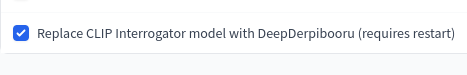
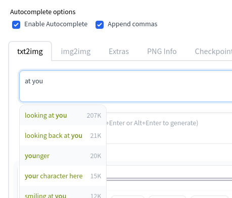

# webui pony extension
Install this via the extensions tab in the webui

## Deepderpibooru
This extension adds the [Deepderpibooru](https://github.com/64617/deepderpibooru) model for use.

By default, **the CLIP Interrogator model will be replaced** with deepderpibooru. This means that webui features like the `Interrogate CLIP` button, or `Use BLIP for captioning` will silently use deepderpibooru instead of base CLIP.

If this behaviour is undesired, you can toggle it in the settings tab:

## Tag autocomplete
This extension adds a derpibooru-flavored version of [tag autocomplete](https://github.com/DominikDoom/a1111-sd-webui-tagcomplete). 

Installation method is experimental and may break often.
